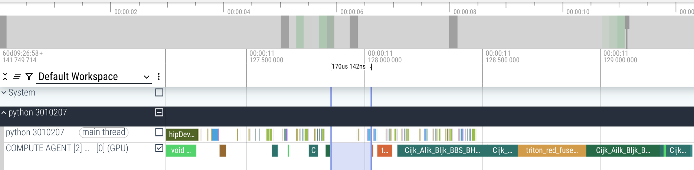
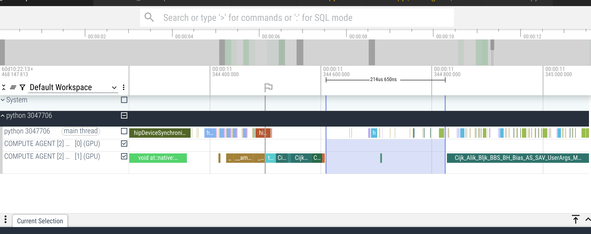

# Technical Report

## 1. AMD-FP8-GEMM

### Overview

Implemented block-wise matrix multiplication using HIP and the rocWMMA library. Each thread block computes a BM × BN output tile, with a loop inside the block iterating K / BK times. A hierarchical accumulation scheme is employed, requiring two sets of BM × BK × sizeof(float) accumulators. The first set holds intermediate fragment results from each matrix core operation, while the second set accumulates the scaled results over K.

### Optimization (ordered by importance)

1. Transpose input matrices to improve L2 cache hit rate and HBM bandwidth utilization.
2. Batch GDS-to-LDS memory loads.
3. Pad shared memory to avoid bank conflicts.
4. Split-K to improve CU occupancy when M and N are small but K is large.
5. Pipeline GDS-to-LDS loading and Matrix Core computation (requires doubling register buffers).
6. Fast (but unsafe) float-to-bfloat16 casting.
7. Block swizzling to further increase L2 cache hit rate.

### Future Work

1. The current GEMM implementation consists of two versions:
    - **gemm_kernel_legacy:** The early version supporting all matrix shapes. Only implements optimizations 2, 4, 6, and 7. Less performant, but offers greater flexibility in supported shapes and parameters.
    - **gemm_kernel:** The current, much faster version, written in a more rigid style, and only supports benchmark shapes and specific template parameters (BM=256, BN=128, BK=128). Implements all optimizations listed above.

   Enhancing `gemm_kernel` to support more template parameter combinations (e.g., BM=128, BN=256) would enable better tuning for various problem sizes and shapes.

2. Swizzling data in LDS to avoid explicit padding.

   Currently, we add 8-element padding in LDS to avoid bank conflicts. This approach increases LDS usage, which in turn limits the largest buffer size (e.g., BM=256, BN=256, BK=128) that can be allocated. Investigating methods to swizzle data within LDS and eliminate the need for padding could help relieve LDS constraints.

3. Utilize asynchronous buffer loads.

   Employing asynchronous buffer load instructions (e.g., `buffer_load_dword` with the LDS suffix) can potentially reduce register usage and enable more efficient instruction pipelines. Initial experiments with this approach, using inline assembly, showed that manual instruction scheduling is required.

## 2 AMD-MoE-Experts

### Overview

This MoE Kernel implementation consists of three main stages:

1. Reorganize data using an expert-centric approach, generating a matrix of size SEQ_LEN (since tokens are independent of each other, the batch dimension is not considered separately here, so SEQ_LEN refers to the dataset's SEQ_LEN multiplied by BATCH_SIZE) where tokens handled by the same expert are arranged in a large matrix
2. Use the Grouped GEMM operator provided by hipBLASlt to compute results for each expert separately
3. Reverse the data permutation from matrix A back to the result matrix to obtain the output

### Specific Implementation Stages

(Inspired by TensorRT-LLM)

1. Obtain input matrix I(SEQ_LEN, D_HIDDEN), multiply it with router weights through PyTorch code to get rank matrix R(SEQ_LEN, N_SHARED_EXPERTS)
2. Find the top-k experts in matrix R, obtaining the IDs of the top-k experts selected by each token and their corresponding weights
3. Use the hipCUB library to sort (expert ID, token index) pairs and calculate the token range handled by each expert
4. Reorganize data and establish mapping relationships. Obtain matrix A(SEQ_LEN * N_EXPERTS_PER_TOKEN, D_HIDDEN) and the offset of the first token handled by each expert
5. Use hipBLASlt to compute Grouped GEMM. The i-th expert is responsible for computing A[first_token_offset[i]:first_token_offset[i+1], :]
6. Reverse the data permutation from matrix A back to the result matrix while multiplying by the corresponding weights
 

## 3 AMD-MLA-Decoding

### Overview

This implementation uses PyTorch to realize MLA Decoding, featuring matrix absorption optimizations and simple element-wise fusion.

### Optimization

1. **Algorithm Optimization: Reshuffling Computation Order with Associative Law** [[1](https://developnotes.readthedocs.io/zh-cn/latest/deepseek.html#absorb)] [[2](https://zhuanlan.zhihu.com/p/700214123)]

   Leveraging the associative law, we reorder score computations:

   - $(c^Q \cdot W_i^{UQ})\cdot((W_i^{UK})^T \cdot (c^{KV})^T)$ → $(c^Q \cdot W_i^{UQ}\cdot(W_i^{UK})^T) \cdot (c^{KV})^T$
   - For example, when the kvcache length is 6144, this transformation can reduce computation by up to $\frac{513 \times 6144}{4\times 6144+512}=125.6$ times.

   Similarly, we reorder the computation for the vup weights (analytical estimation; the actual numbers may vary):

   - $attn \cdot ((c^{KV})^T \cdot (W^{UV})^T )$ → $(attn \cdot (c^{KV})^T) \cdot (W^{UV})^T$
   - Tensor shapes:
     - $attn: bhsp$
     - $c^{KV}: bpl$
     - $W^{UV}: hlv$
   - This operation reduces computational cost:

$$
\frac{2bhspv+2bhpvl}{2bhspl+2bhslv}=\frac{spv+pvl}{spl+slv}=\frac{1\times6144\times 128 + 6144\times128\times512}{1\times6144\times512+1\times512\times512}=118.3
$$

2. **Operator Fusion with `torch.compile`**

   1. Fusing multiple element-wise operations in RoPE
   2. Fusing softmax with adjacent element-wise operations

3. **Reducing CPU Overhead Using CUDA Graphs**

   1. Measurements on evaluation machine are based on CPU timing.
   2. The attention projection and RoPE stages have relatively small per-kernel compute (~5us), but high kernel launch overhead (~170us), resulting in significant GPU bubble.

   

   3. We use rocBLAS GEMM kernels directly, but these kernels are not CUDA graph friendly as replaying requires kvcache to reside at the same memory address. This necessitates kvcache copies each time; testing shows that capturing the entire CUDA graph directly actually degrades performance due to the copy overhead.

   4. Therefore, we capture only the projection and RoPE stages to avoid kvcache copy overhead. This mitigates part of the bubble issue, though there is still considerable room for improvement.

   